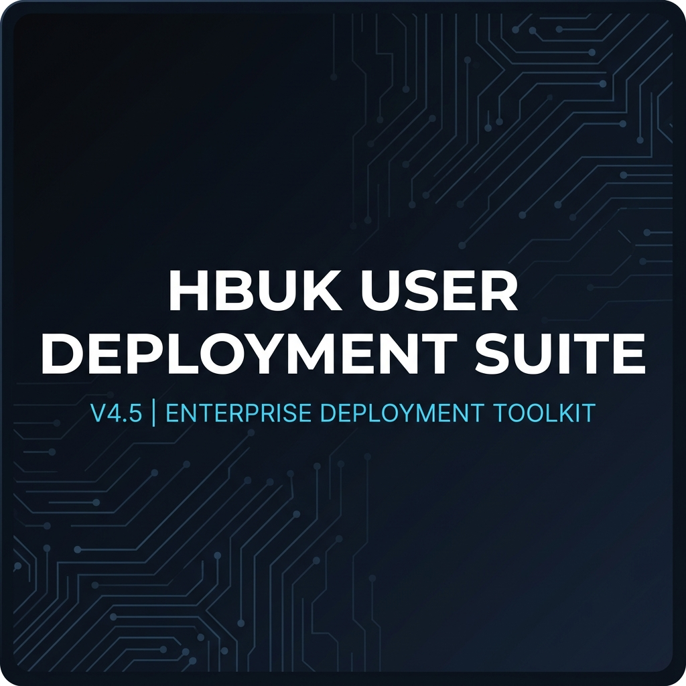

<p align="center">
  
</p>

<p align="center">
  
  
  
  
</p>

<p align="center">
  <b>Alat pengurusan deployment komputer secara portable untuk Hospital Bahagia Ulu Kinta (HBUK)</b><br/>
  <i>Unit Pengurusan Maklumat (UPM) | KKM</i>
</p>

---

## ✨ Ciri-Ciri Utama

| Modul | Fungsi |
|-------|--------|
| 👤 **Pengurusan Pengguna** | Cipta, padam, tukar kata laluan & jenis akaun pengguna lokal |
| 🖥️ **RustDesk** | Pasang, konfigurasi server, tetapkan ID & kata laluan kekal, nyahpasang bersih |
| 📡 **SPAI Agent** | Pasang GLPI Agent dengan auto-tagging lokasi organisasi (KKM > JKN > HBUK > ...) |
| 🎨 **Tema Windows** | Pasang tema HBUK gelap/cerah secara automatik |
| 🧹 **Housekeeping** | Bersihkan fail sementara, cache, DNS, dan Recycle Bin |
| ℹ️ **Tentang Suite** | Dialog maklumat versi dengan pautan GitHub |

## 🚀 Cara Penggunaan

### Prasyarat
- Windows 10/11 (64-bit)
- PowerShell 5.1 atau lebih tinggi
- Hak Administrator (Run as Admin)

### Langkah

1. **Muat turun** — Clone repo atau muat turun ZIP
2. **Salin ke USB** — Letakkan keseluruhan folder pada pemacu USB
3. **Konfigurasi** — Salin fail `.example.txt` dan isi maklumat sebenar:
   ```
   packages/config/rustdesk_config.example.txt  →  rustdesk_config.txt
   packages/config/spai_config.example.txt      →  spai_config.txt
   ```
4. **Letakkan installer** — Masukkan fail MSI ke dalam `packages/installer/`:
   - `rustdesk-x.x.x-x86_64.msi`
   - `GLPI-Agent-x.xx-x64.msi`
   - `VC_redist.x64.exe` ke dalam `packages/tools/`
5. **Jalankan** — Klik dua kali:
   - `HBUK_USER_DEPLOYMENT_SUITE_V4.5.vbs` (Silent launch)
   - `HBUK_USER_DEPLOYMENT_SUITE_V4.5.exe` (Dengan ikon terbenam)

## 📁 Struktur Projek

```
📦 HBUK_DEPLOYMENT_SCRIPT
├── 🚀 HBUK_USER_DEPLOYMENT_SUITE_V4.5.vbs    ← Launcher utama
├── 🚀 HBUK_USER_DEPLOYMENT_SUITE_V4.5.exe    ← Launcher alternatif
├── 📂 _core/
│   ├── HBUK_USER_DEPLOYMENT_SUITE_V4.5.ps1    ← Skrip utama (GUI)
│   ├── Build_Launcher.ps1                      ← Bina .exe launcher
│   └── Build_Release.ps1                       ← Jana ZIP pengedaran
├── 📂 packages/
│   ├── config/
│   │   ├── rustdesk_config.example.txt         ← Template konfigurasi
│   │   └── spai_config.example.txt             ← Template konfigurasi
│   ├── icons/
│   │   └── upm_logo.ico                        ← Ikon UPM
│   ├── installer/                              ← (Tidak dalam repo)
│   │   ├── rustdesk-x.x.x-x86_64.msi
│   │   └── GLPI-Agent-x.xx-x64.msi
│   ├── themes/
│   │   ├── HBUK_THEME_DARK.deskthemepack
│   │   └── HBUK_THEME_LIGHT.deskthemepack
│   └── tools/                                  ← (Tidak dalam repo)
│       └── VC_redist.x64.exe
└── 📂 logs/                                    ← Auto-generated
```

## 🎨 Tangkapan Skrin

### Antara Muka Utama
> Mod cerah dengan sidebar maklumat sistem dan menu navigasi

### Mod Gelap
> Tema gelap moden dengan palet GitHub Dark untuk keselesaan mata

### Dialog Tentang
> Maklumat versi, organisasi, dan pautan pembina

## ⚙️ Konfigurasi

### RustDesk (`packages/config/rustdesk_config.txt`)
```ini
ID_SERVER=YOUR_SERVER_IP
RELAY_SERVER=YOUR_RELAY_IP
KEY=YOUR_PUBLIC_KEY
PASSWORD=YOUR_ADMIN_PASSWORD
```

### SPAI Agent (`packages/config/spai_config.txt`)
```ini
SERVER=http://YOUR_SPAI_SERVER_IP,https://YOUR_SPAI_URL/
```

> ⚠️ **Nota:** Fail konfigurasi sebenar **tidak** disertakan dalam repositori ini atas sebab keselamatan. Sila salin daripada fail `.example.txt` dan isi dengan maklumat organisasi anda.

## 🏗️ Membina Pakej Pengedaran

Untuk menjana ZIP bersih yang boleh diedarkan kepada rakan sekerja:

```powershell
powershell -ExecutionPolicy Bypass -File _core\Build_Release.ps1
```

ZIP yang dihasilkan mengandungi semua fail yang diperlukan termasuk installer dan konfigurasi sebenar, tanpa fail pembangunan.

## 🔧 Ciri Teknikal

- **Portable** — Tidak perlu pemasangan. Jalankan terus dari USB pada mana-mana PC
- **Auto-Elevation** — Meminta hak Administrator secara automatik jika diperlukan
- **Externalized Config** — Semua konfigurasi sensitif disimpan dalam fail teks luaran
- **Dark/Light Mode** — Togol tema moden dengan palet GitHub Dark
- **Log Berstruktur** — Setiap sesi disimpan dalam `logs/` dengan cap masa
- **WinForms GUI** — Antara muka grafik penuh tanpa kebergantungan luar

## 📋 Sejarah Versi

| Versi | Tarikh | Perubahan |
|-------|--------|-----------|
| **V4.5** | 2026-05-10 | Tema gelap moden, dialog Tentang premium, pembersihan keselamatan untuk repo awam |
| **V4.0** | 2026-04-25 | Penstrukturan menu SPAI, pengurusan pengguna moden, konfigurasi RustDesk |
| **V3.x** | 2026-04 | Migrasi ke GUI PowerShell, pemasangan SPAI automatik |
| **V1-2** | 2026-03 | Skrip batch asal untuk deployment manual |

## 👨‍💻 Pembina

**CAPIK** — Unit Pengurusan Maklumat (UPM), Hospital Bahagia Ulu Kinta

[](https://github.com/C4P1K)

---

<p align="center">
  <i>Dibangunkan untuk memudahkan pengurusan user deployment komputer HBUK</i><br/>
  <b>🏥 Hospital Bahagia Ulu Kinta | KKM</b>
</p>
